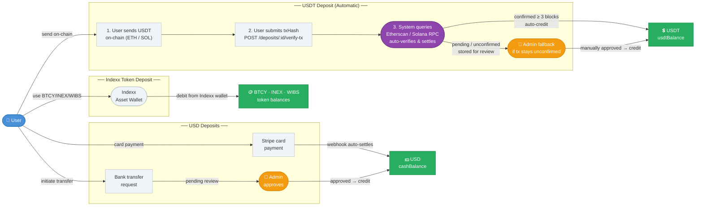
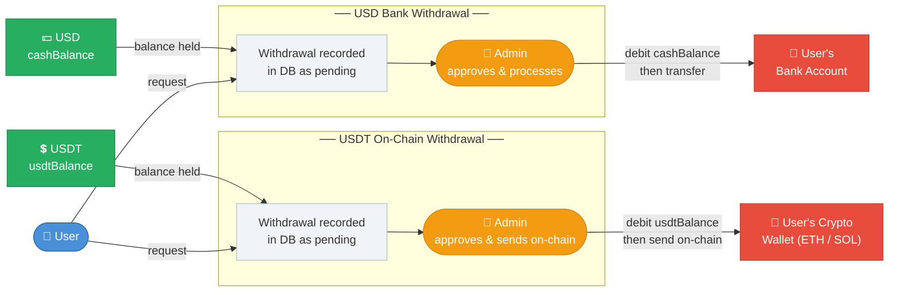
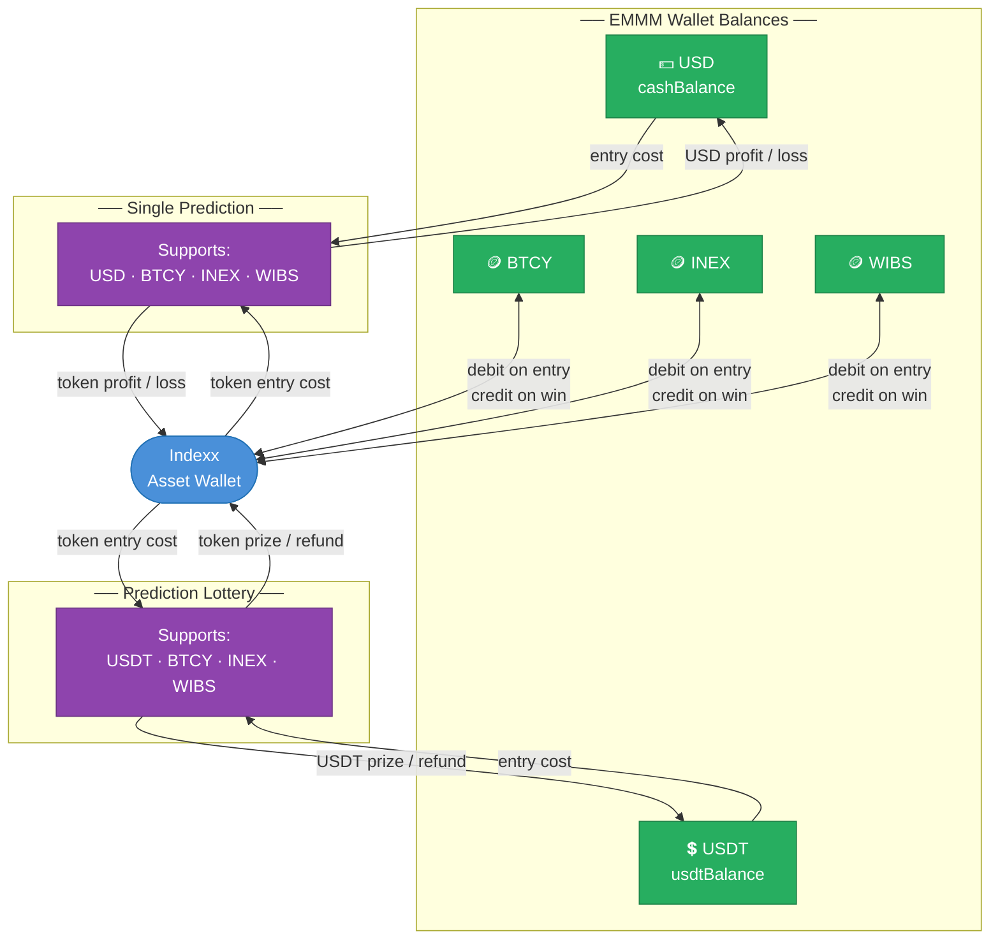

# USD, USDT & Indexx Token — Deposit, Withdrawal & Prediction Flow

> Documents the intended funds flow after separating USDT from USD cash.

---

## Currency Support at a Glance

| Currency | Deposit Method | Withdrawal Method | Single Prediction | Lottery |
|----------|---------------|-------------------|:-----------------:|:-------:|
| **USD**  | Stripe card · Bank transfer | Bank transfer | ✅ | ❌ |
| **USDT** | On-chain (ETH / SOL) | On-chain (ETH / SOL) | ❌ | ✅ |
| **BTCY** | Indexx wallet | — | ✅ | ✅ |
| **INEX** | Indexx wallet | — | ✅ | ✅ |
| **WIBS** | Indexx wallet | — | ✅ | ✅ |

---

## 1 · Deposit Flow

How money enters the EMMM wallet.



---

## 2 · Withdrawal Flow

How money leaves the EMMM wallet.



---

## 3 · Prediction Market Flow

How balances are used in prediction markets and how winnings are returned.



---

## Rules Enforced

- **USD deposits** from Stripe (auto via webhook) and bank transfer (admin approval) credit `cashBalance`.
- **USDT deposits** on Ethereum or Solana use automatic on-chain verification:
  1. User sends USDT on-chain and receives a deposit address.
  2. User submits the transaction hash via `POST /api/deposits/:depositId/verify-tx`.
  3. The system queries Etherscan (Ethereum) or Solana RPC to verify the tx.
  4. If ≥ 3 confirmations (ETH) / ≥ 20 confirmations (SOL) and amount matches → `usdtBalance` is credited automatically.
  5. If the tx is still unconfirmed, the deposit is marked `awaiting_confirmation` and admin can approve manually as a fallback.
- **USDT withdrawals** are recorded as pending in `withdrawals`; admin manually sends on-chain and then debits `usdtBalance`.
- **Bank withdrawals** are recorded as pending in `withdrawals`; admin processes the bank transfer and then debits `cashBalance`.
- **Single Prediction** supports `USD`, `BTCY`, `INEX`, and `WIBS`. USD uses `cashBalance`; tokens use the Indexx debit/credit flow.
- **Prediction Lottery** supports `USDT`, `BTCY`, `INEX`, and `WIBS`. USDT entry and prizes use `usdtBalance` only — never `cashBalance`.
- Indexx token balances (`BTCY`, `INEX`, `WIBS`) are always debited/credited through the Indexx Asset Wallet, not directly.

## API Reference — USDT Deposit (Automatic On-Chain)

| Step | Method | Endpoint | Body |
|------|--------|----------|------|
| 1. Get deposit address | `GET` | `/api/deposits/crypto-address?token=usdt&chain=ethereum` | — |
| 2. Create deposit record | `POST` | `/api/deposits` | `{ method: "crypto", token: "usdt", chain: "ethereum", amount: 100 }` |
| 3. Send USDT on-chain | — | User action in wallet | Send to the address returned in step 1 |
| 4. Submit txHash | `POST` | `/api/deposits/:depositId/verify-tx` | `{ txHash: "0x..." }` |

**Verify-tx response examples:**

```json
// Auto-settled (confirmed)
{ "deposit": { "status": "settled", ... }, "verification": { "status": "confirmed", "confirmations": 5, "txAmount": 100, "blockchainUrl": "https://etherscan.io/tx/0x..." } }

// Still pending
{ "deposit": { "status": "awaiting_confirmation", ... }, "verification": { "status": "pending", "confirmations": 1, "message": "Transaction has 1 of 3 required confirmations. Try again shortly." } }

// Wrong address or amount
{ "deposit": { ... }, "verification": { "status": "wrong_recipient" | "amount_mismatch", "message": "..." } }
```
